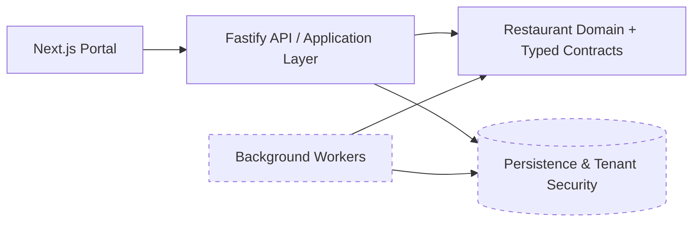

# Public Architecture Overview

Restaurant AI Platform is structured as a multi-tenant SaaS platform with explicit boundaries between the portal, API/application layer, domain/contracts, and persistence/security layers.

This public snapshot exposes representative code from the portal, application, domain, and contract layers. Persistence, RLS/security internals, authentication, support-access mechanisms, worker implementation, and provider credentials are intentionally omitted.

## Engineering themes

- explicit restaurant/branch domain logic
- typed contracts between layers
- command/query application boundaries
- tenant-aware design
- automated unit, integration, database, E2E, and milestone security testing in the private source
- provider-neutral integration direction for messaging, AI, and speech

## Public snapshot boundary

The code here is intentionally incomplete as a runnable system. Imports that point to omitted internal packages are retained where useful to show how the selected source fits into the wider architecture; those private packages are not required to evaluate the code patterns shown here.
